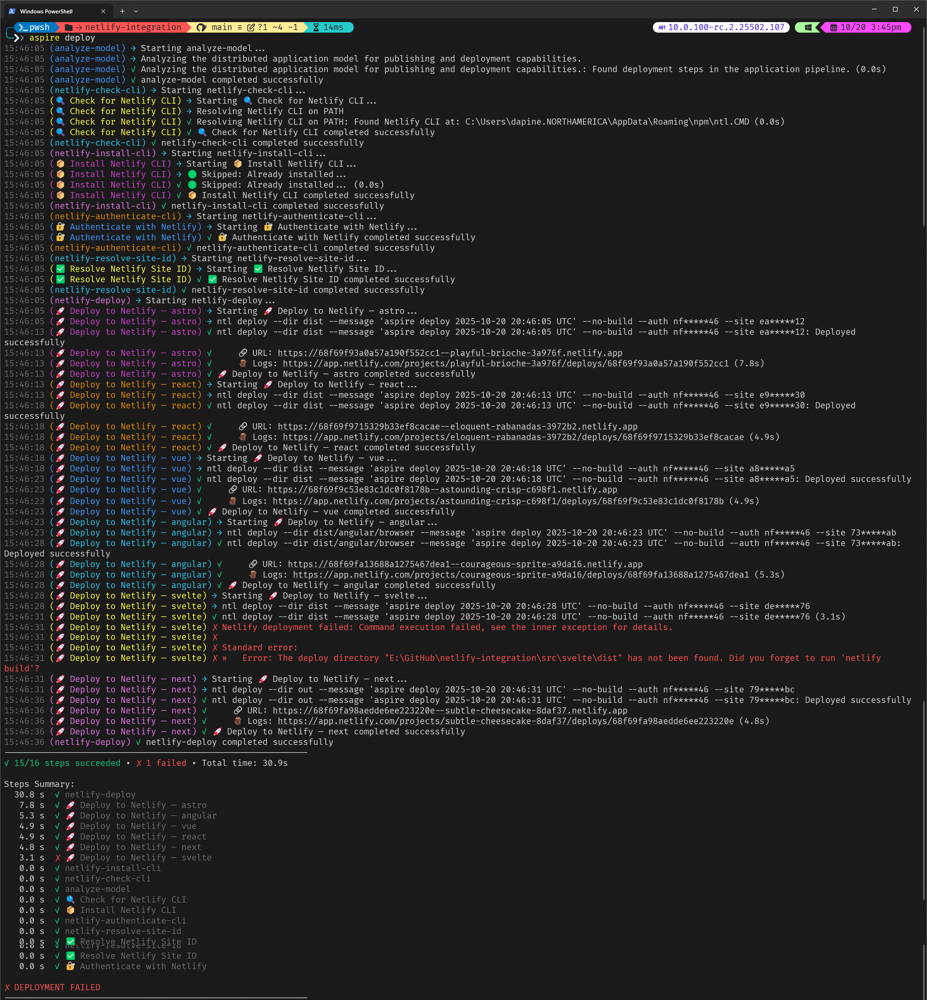

# 🚀 `Aspire.Hosting.Netlify`

[](https://github.com/IEvangelist/netlify-aspire-integration/actions/workflows/pr-validation.yml) [](https://github.com/IEvangelist/netlify-aspire-integration/actions/workflows/aspire-deploy.yml) [](https://github.com/IEvangelist/netlify-aspire-integration/actions/workflows/publish-nuget.yml)

Deploy your frontend projects to Netlify directly from your Aspire AppHost. Build, run locally, and publish to production—all from a single, elegant configuration.

## 🖼️ See It In Action

The terminal screenshot below shows the seamless deployment process in action—watch as your Astro site gets built and deployed to Netlify with simple, clear progress indicators. Notice how the process automatically handles the build steps and provides immediate feedback on the deployment status.



## ✨ Why This is Cool

Imagine running your frontend app locally during development and deploying it to Netlify for production **with the exact same code**. No separate deployment scripts, no context switching—just pure Aspire orchestration magic.

## 🎯 Quick Start

Here's all you need to get started:

```csharp
var builder = DistributedApplication.CreateBuilder(args);

// Complete workflow:
// - Run    →   npm run dev
// - Deploy →   netlify deploy
builder.AddNpmApp("sample", "../astro", "dev")
       .WithHttpEndpoint(targetPort: 4321)
       .PublishAsNetlifySite(new NetlifyDeployOptions() { Dir = "dist" });

builder.Build().Run();
```

That's it! 🎉

## 🔄 How It Works

### During Development (`aspire run`)

- Runs `npm run dev` in your astro directory
- Exposes your app on port 4321
- Hot reload and all your favorite dev features work as expected

### During Deployment (`aspire deploy`)

- Builds your static site
- Deploys the `dist` folder to Netlify
- Your site goes live automatically

## 📦 What You Need

- .NET 9.0 or later
- Node.js and npm installed
- A Netlify account (free tier works great!)
- An Astro project (or any other npm-based frontend)

## 🛠️ Setup

1. **Install the package** (when published):

   ```bash
   dotnet add package Aspire.Hosting.Netlify
   ```

2. **Configure your AppHost**:

   ```csharp
   builder.AddNpmApp("myapp", "../path-to-frontend", "dev")
          .WithHttpEndpoint(targetPort: 4321)
          .PublishAsNetlifySite(new NetlifyDeployOptions() 
          { 
              Dir = "dist" // Your build output directory
          });
   ```

3. **Run locally**:

   ```bash
   aspire run
   ```

4. **Deploy to Netlify**:

   ```bash
   aspire deploy
   ```

## 🎨 Example Projects

This works great with:

- ⚡ **Astro** (like our astro example)
- ⚛️ **React** (Create React App, Vite)
- 💚 **Vue** (Vite, Nuxt)
- 🅰️ **Angular**
- 📘 **Next.js** (static export)
- And any other npm-based frontend framework!

## 💡 Key Features

- **🔄 Unified workflow**: Same code for dev and deploy
- **🎯 Type-safe**: Full IntelliSense support in your AppHost
- **🚀 Fast**: Leverages Netlify's CDN for blazing-fast delivery
- **🔧 Flexible**: Works with any npm-based project
- **📊 Integrated**: Fits perfectly into your Aspire architecture

## 📝 License

MIT License - see [LICENSE](LICENSE) file for details

---

### Made with ❤️ for the Aspire community
