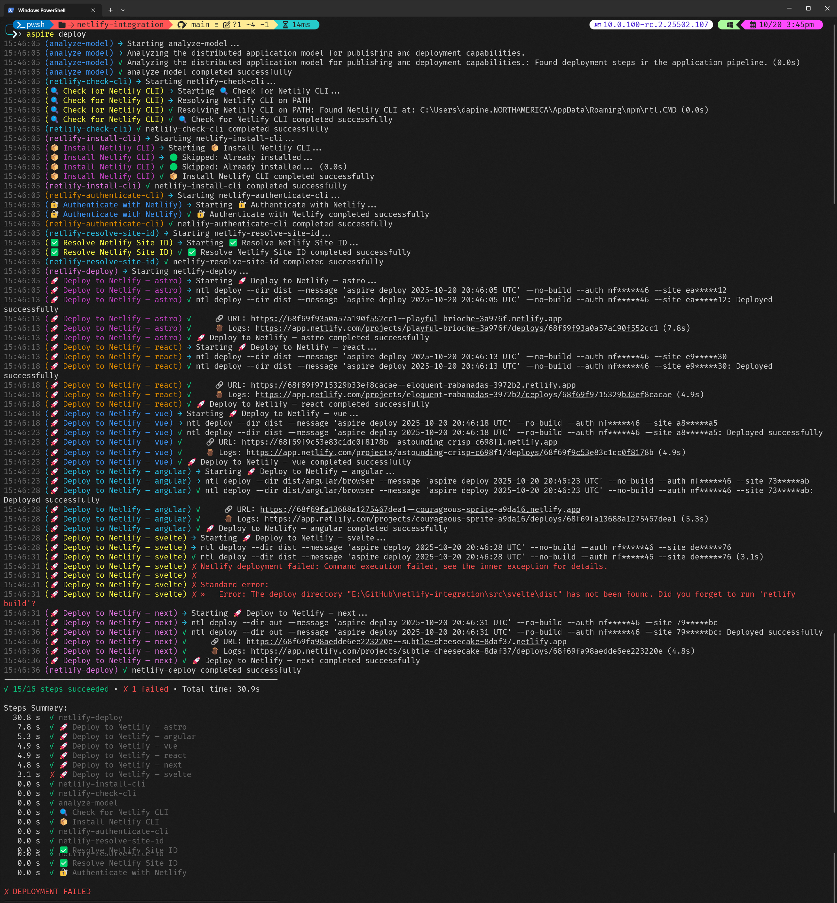

# 🚀 Aspire.Hosting.Netlify

> Published to NuGet as **`IEvangelist.Aspire.Hosting.Netlify`** — the `Aspire.*` prefix is reserved by Microsoft, so this community integration ships under the `IEvangelist.*` prefix.

[](https://www.nuget.org/packages/IEvangelist.Aspire.Hosting.Netlify)
[](https://github.com/IEvangelist/netlify-aspire-integration/actions/workflows/pr-validation.yml)
[](https://github.com/IEvangelist/netlify-aspire-integration/actions/workflows/publish-nuget.yml)
[](LICENSE)

> **Deploy any JavaScript frontend to Netlify with three lines of C#.**
>
> A first-party-feeling [Aspire](https://aspire.dev) integration that turns
> `aspire deploy` into a one-command Netlify deploy — for Angular, Astro, Next.js,
> React, Svelte, Vue, and anything else `AddJavaScriptApp` understands.

📚 **[Read the docs →](https://ievangelist.github.io/netlify-aspire-integration/)**



## Quickstart

```sh
dotnet add package IEvangelist.Aspire.Hosting.Netlify
dotnet add package Aspire.Hosting.JavaScript
dotnet add package CommunityToolkit.Aspire.Hosting.JavaScript.Extensions
```

```csharp
var builder = DistributedApplication.CreateBuilder(args);

builder.Pipeline.AddNetlifyDeployPipeline();

builder.AddJavaScriptApp("astro", "../astro")
    .PublishAsNetlifySite("dist");

builder.Build().Run();
```

```sh
aspire run     # boots the dev server alongside the dashboard
aspire deploy  # builds and ships to Netlify
```

That's it. The pipeline finds the Netlify CLI (auto-installs if missing), resolves
your auth token (parameter > `NETLIFY_AUTH_TOKEN` > interactive `ntl login`), and
deploys the directory you point it at.

## Why this integration?

- 🪄 **Pipeline-aware.** Hooks into Aspire's deploy pipeline, so `aspire deploy`
  is the one command. No bespoke shell scripts, no hand-rolled GitHub Actions.
- 🟦 **Multi-language.** Annotated with the
  [Aspire Type System](https://aspire.dev/architecture/multi-language-architecture/)
  so a TypeScript AppHost gets fully-typed `publishAsNetlifySite(...)`.
- 🔐 **Secret-safe auth.** Tokens flow through `IResourceBuilder<ParameterResource>`;
  Site IDs and tokens are redacted from logs.
- 🌐 **Six framework demos.** Angular, Astro, Next.js, React, Svelte, and Vue
  under [`samples/`](samples/).
- 📦 **OIDC-published.** No long-lived NuGet API key — releases are published via
  [Trusted Publishing](https://ievangelist.github.io/netlify-aspire-integration/guides/ci-cd/)
  on every tagged release.

## Documentation

The full docs site lives at
**<https://ievangelist.github.io/netlify-aspire-integration/>** and is
self-updating: every push to `main` rebuilds it from the markdown under
[`docs/`](docs/) and the C# XML doc comments under
[`src/IEvangelist.Aspire.Hosting.Netlify/`](src/IEvangelist.Aspire.Hosting.Netlify/).

| | |
| --- | --- |
| 🚀 [C# Quickstart](https://ievangelist.github.io/netlify-aspire-integration/guides/quickstart-csharp/) | Drop the integration into a fresh C# AppHost. |
| 🟦 [TypeScript Quickstart](https://ievangelist.github.io/netlify-aspire-integration/guides/quickstart-typescript/) | Use the multi-language Aspire Type System surface. |
| 🛠️ [Configuration](https://ievangelist.github.io/netlify-aspire-integration/guides/configuration/) | Every option on `NetlifyDeployOptions`. |
| 🔐 [Authentication](https://ievangelist.github.io/netlify-aspire-integration/guides/auth/) | Token precedence, secrets, and `ntl login`. |
| 🤖 [CI/CD](https://ievangelist.github.io/netlify-aspire-integration/guides/ci-cd/) | OIDC publishing, Aspire Deploy, GitHub Actions. |
| 📚 [API reference](https://ievangelist.github.io/netlify-aspire-integration/api/) | Auto-generated from XML doc comments. |

## Samples

Six framework demos plus two quickstarts live under [`samples/`](samples/). Each
sample has its own README:

```sh
# Single-site quickstart (Astro + directory-only overload).
aspire run --apphost samples/Quickstart.AppHost/Quickstart.AppHost.csproj

# Six-framework demo.
aspire run --apphost samples/AllFrameworks.AppHost/AllFrameworks.AppHost.csproj
```

## Contributing

Issues and PRs welcome on [GitHub](https://github.com/IEvangelist/netlify-aspire-integration).
The codebase is straightforward: the integration lives in
[`src/IEvangelist.Aspire.Hosting.Netlify/`](src/IEvangelist.Aspire.Hosting.Netlify/), tests in
[`src/IEvangelist.Aspire.Hosting.Netlify.Tests/`](src/IEvangelist.Aspire.Hosting.Netlify.Tests/), samples
in [`samples/`](samples/), and docs in [`docs/`](docs/).

```sh
dotnet build      # build everything
dotnet test       # run the test suite (50+ tests)
aspire run        # launch the AllFrameworks demo
```

## License

[MIT](LICENSE)
